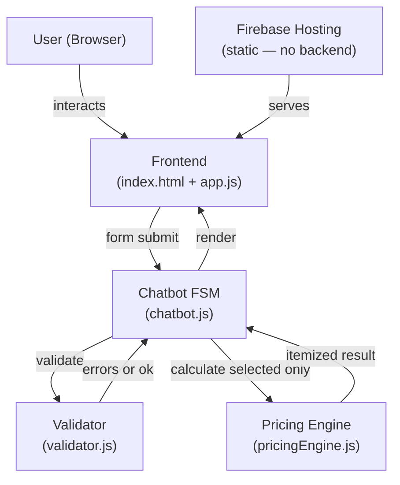
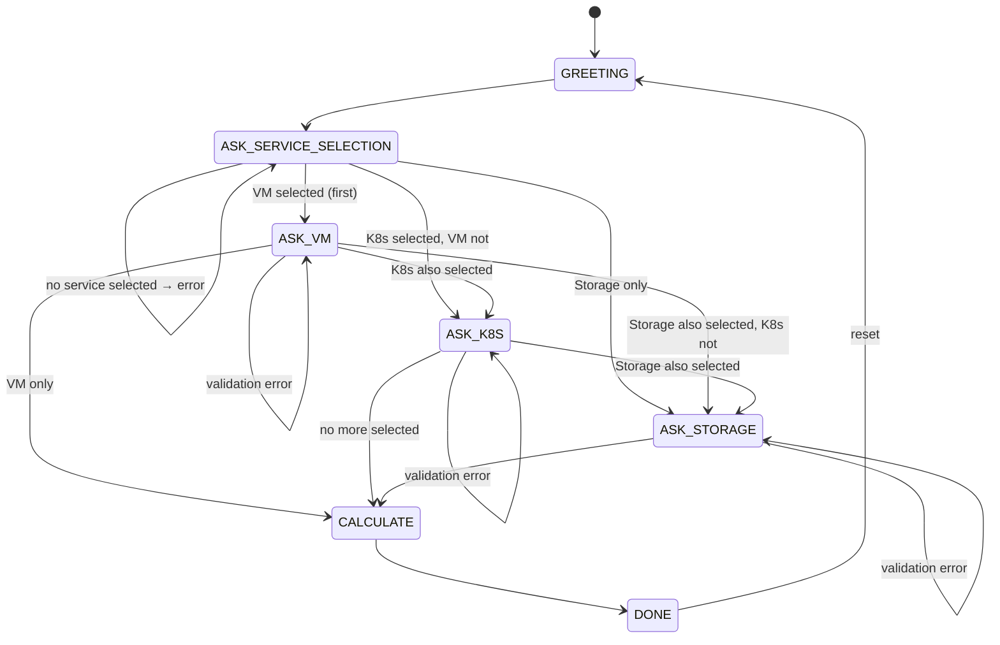

# CFO Bot — Implementation Plan (v2)

**Version**: 2.0 | **SSOT**: `cfo-bot-ssot-cloud.md` | **Currency**: KZT

> [!IMPORTANT]
> **v2 change**: Services are now **optional** (SSOT §7). Users may select any combination of Virtual Machines, Kubernetes Cluster, and Cloud Storage. At least one must be selected. Unselected services require no input, trigger no validation, and contribute 0 to the total.

---

## Background

CFO Bot is a deterministic finite-state machine chatbot. No LLM API is used. All calculation logic runs client-side. Response time is well under 3 seconds (SSOT §13).

---

## System Architecture



---

## FSM State Machine (v2)



**Key rule (SSOT §7)**: The FSM only visits a service state if that service was checked in `ASK_SERVICE_SELECTION`. Unchecked services are skipped entirely.

---

## Module Design

### `pricingEngine.js` — No changes in v2

All rates and formulas are identical to v1. `pricingEngine.js` is unchanged.

For unselected services, the chatbot substitutes a **zero result object** before calling `calcGrandTotal()` — the engine itself never receives invalid data.

---

### `validator.js` — v2 addition

New export: `validateServiceSelection(selected)`

```js
// SSOT §7
export function validateServiceSelection({ vm, k8s, storage }) {
  if (!vm && !k8s && !storage)
    return { valid: false, errors: ["At least one service category must be selected."] };
  return { valid: true, errors: [] };
}
```

`validateVM`, `validateKubernetes`, `validateStorage` are unchanged — they are simply never called for unselected services.

---

### `chatbot.js` — v2 FSM

New state: `ASK_SERVICE_SELECTION`

New stored state:
```js
this._selected = { vm: false, k8s: false, storage: false };
```

Navigation helpers:
- `_nextAfterSelection()` — goes to first selected service form
- `_nextAfter(completed)` — skips to next selected service or `CALCULATE`

Unselected services use zero-result constants (SSOT §8):
```js
const ZERO_VM      = { totalCost: 0, ... };
const ZERO_K8S     = { totalCost: 0, ... };
const ZERO_STORAGE = { totalCost: 0, ... };
```

---

### `app.js` — v2 conditional rendering

`renderResults()` receives `selected` map from FSM. Result cards for unselected services are hidden:

```js
cardVm.classList.toggle("hidden", !selected.vm);
cardK8s.classList.toggle("hidden", !selected.k8s);
cardStorage.classList.toggle("hidden", !selected.storage);
```

Service selection form uses `service-checkbox-field` class (styled to look like interactive tiles, not plain checkboxes).

---

## File Structure

```
tsis3/
├── public/
│   ├── index.html          ← App shell (unchanged)
│   ├── styles.css          ← + service-grid, service-checkbox-field styles
│   ├── app.js              ← v2: conditional result card visibility
│   └── src/
│       ├── pricingEngine.js ← unchanged
│       ├── validator.js     ← v2: + validateServiceSelection()
│       └── chatbot.js       ← v2: new ASK_SERVICE_SELECTION state
├── src/                    ← source originals
│   ├── pricingEngine.js
│   ├── validator.js
│   ├── chatbot.js
│   └── test.js             ← v2: 32 assertions (+ §7 service selection tests)
├── firebase.json
└── .firebaserc
```

---

## Validation Rules (complete)

| Validator | Rule | Message |
|---|---|---|
| `validateServiceSelection` | at least one of vm/k8s/storage = true | `At least one service category must be selected.` |
| `validateVM` | vm_count ≥ 0 (int) | `VM count must be 0 or greater.` |
| `validateVM` | cpu_cores > 0 (int) when vm_count > 0 | `CPU cores must be a positive integer.` |
| `validateVM` | ram_gb > 0 when vm_count > 0 | `RAM must be greater than 0.` |
| `validateVM` | nvme_gb + hdd_gb > 0 when vm_count > 0 | `At least one VM disk must be specified.` |
| `validateKubernetes` | master_count ≥ 1 (int) | `Master node count must be at least 1.` |
| `validateKubernetes` | disk_type ∈ {nvme, hdd} | `Disk type must be either nvme or hdd.` |
| `validateKubernetes` | worker_count ≥ 0 (int) | `Worker count must be 0 or greater.` |
| `validateStorage` | storage_gb ≥ 0 | `Storage volume must be 0 or greater.` |
| `validateStorage` | write_requests ≥ 0 (int) | `Write requests must be 0 or greater.` |
| `validateStorage` | read_requests ≥ 0 (int) | `Read requests must be 0 or greater.` |

---

## UI / UX Rules (SSOT §11.1)

| Rule | Implementation |
|---|---|
| Separate selection control per service | Three checkboxes in `ASK_SERVICE_SELECTION` form |
| Show inputs only for selected services | FSM only renders forms for selected services |
| Hide inputs for unselected services | Unselected states are never entered |
| Require at least one selection before calculation | `validateServiceSelection()` enforced before any form |
| Calculate total using only selected categories | ZERO_* constants for unselected; `calcGrandTotal` sums all |
| Result cards show only for selected services | `card.classList.toggle("hidden", !selected.x)` |

---

## Firebase Deployment

```bash
npm install -g firebase-tools
firebase login
# Edit .firebaserc: set your project ID
firebase serve --only hosting   # local test
firebase deploy --only hosting  # deploy
```

---

## Development Sequence (v2 delta)

| Step | Task |
|---|---|
| 1 | `validator.js` — add `validateServiceSelection()` |
| 2 | `chatbot.js` — add `ASK_SERVICE_SELECTION` state + conditional navigation |
| 3 | `app.js` — conditional card visibility in `renderResults()` |
| 4 | `styles.css` — add `service-grid` + `service-checkbox-field` |
| 5 | `src/test.js` — add §7 service selection + §8 zero-cost tests |
| 6 | Run `node src/test.js` — all 32 assertions must pass |
| 7 | Browser test: select Storage only → only Storage card shown, VM/K8s = 0 |
| 8 | Browser test: select no services → error "At least one service must be selected." |
| 9 | `firebase deploy --only hosting` |

---

## Out of Scope (SSOT §3.2)

Managed databases, load balancers, CDN, outbound bandwidth, backup, snapshots, discounts, reserved capacity, promos, region pricing, autoscaling, support plans.
