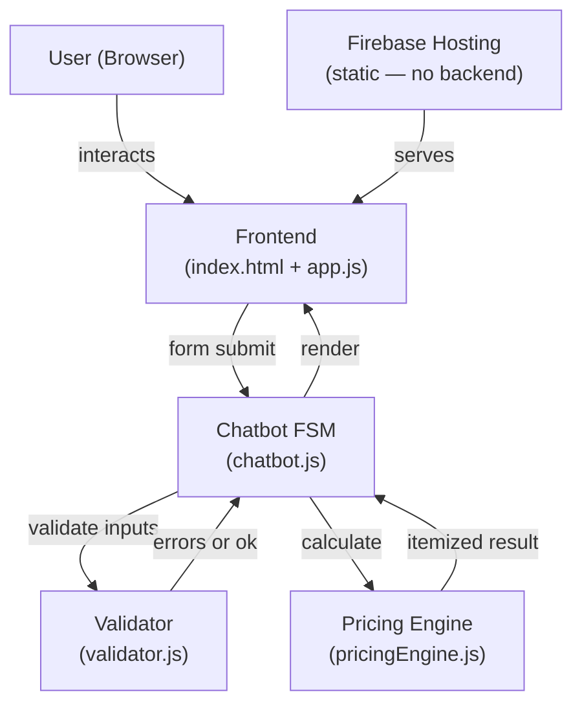
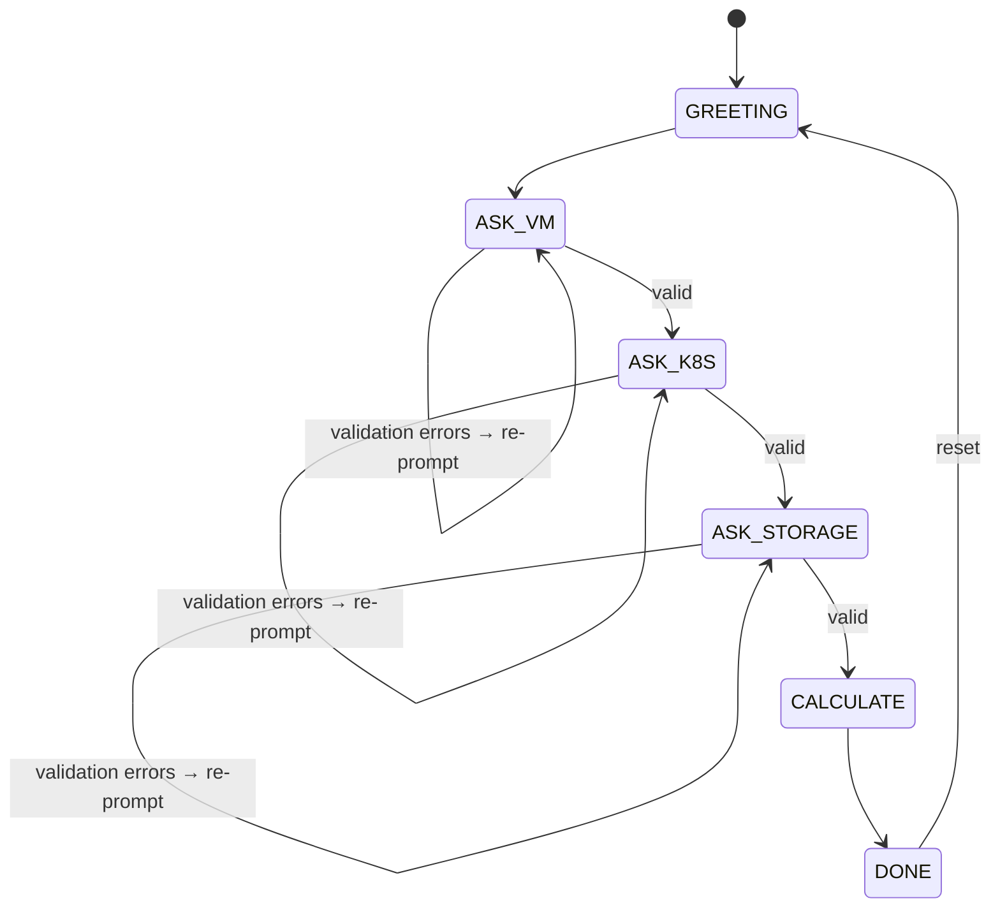

# CFO Bot — Implementation Plan

**Version**: 1.0 | **Currency**: KZT | **Scope**: SSOT §1–§16 only

A web-based cloud cost calculator chatbot that estimates monthly KZT costs for Virtual Machines, Kubernetes Clusters, and Cloud Storage. Strictly derived from `cfo-bot-ssot-ps-cloud-inspired.md`.

---

## Background

The CFO Bot estimates monthly PS Cloud infrastructure costs using deterministic, rounded rates defined in the SSOT. It is not an AI chatbot — it is a finite-state machine with structured input forms. No LLM APIs, live pricing feeds, or external services are used during the calculation step. This guarantees reproducibility per SSOT §9.2 and response times well under 3 seconds (SSOT §12).

---

## System Architecture



> [!NOTE]
> Firebase Functions are **not required**. All logic runs client-side. This eliminates cold starts and keeps every response instantaneous.

---

## Technology Stack

| Layer | Choice | Rationale |
|---|---|---|
| Frontend | HTML5 + Vanilla CSS + ES Modules | No build step; trivial to deploy statically |
| Fonts | Inter (Google Fonts) | Modern, readable, lightweight |
| Hosting | Firebase Hosting | SSOT §11 requirement |
| Backend | None | All pricing is deterministic client-side |
| Package manager | None (cdn fonts only) | Simplest possible static deployment |

---

## File Structure

```
tsis3/
├── public/                     ← Firebase Hosting root
│   ├── index.html              ← App shell, semantic HTML, SEO meta
│   ├── styles.css              ← Design system + responsive layout
│   ├── app.js                  ← UI controller (DOM ↔ FSM bridge)
│   └── src/
│       ├── pricingEngine.js    ← Pure calculation functions
│       ├── validator.js        ← Input validation, SSOT §13 messages
│       └── chatbot.js          ← FSM state machine
├── src/                        ← Source originals (dev reference)
│   ├── pricingEngine.js
│   ├── validator.js
│   ├── chatbot.js
│   └── test.js                 ← Node.js assertion test (node src/test.js)
├── firebase.json               ← Hosting config
└── .firebaserc                 ← Project ID (user must fill in)
```

---

## Module Design

### `pricingEngine.js` — Pure Calculation

All rates are defined in a single frozen constant (SSOT §2.1):

```js
const RATES = Object.freeze({
  CPU: 5500, RAM: 1500, NVME: 140, HDD: 20,
  WHITE_IP: 2500, STORAGE_GB: 12,
  WRITE_PER_1K: 3, READ_PER_10K: 3,
});
```

Exports:

| Function | Inputs | SSOT ref |
|---|---|---|
| `calcVM(params)` | vm_count, cpu_cores, ram_gb, nvme_gb, hdd_gb, white_ip_enabled | §4.4 |
| `calcKubernetes(params)` | master + worker node fields | §5.5 |
| `calcStorage(params)` | storage_gb, write_requests, read_requests | §6.6 |
| `calcGrandTotal(vm, k8s, storage)` | three result objects | §7 |

Key implementation rules:
- `Math.ceil()` for request blocks (SSOT §6.5)
- `disk_type === 'nvme' ? 140 : 20` for rate resolution (SSOT §5.4)
- No cluster management fee (SSOT §5.7)
- `Math.round()` on all displayed KZT values (SSOT §12)

---

### `validator.js` — Input Validation

Three exported functions: `validateVM`, `validateKubernetes`, `validateStorage`. Each returns `{ valid: boolean, errors: string[] }`.

All validation rules and messages are directly from SSOT §4.5, §5.6, §6.7, §13:

| Rule | Condition | Message |
|---|---|---|
| vm_count | `>= 0`, integer | `VM count must be 0 or greater.` |
| cpu_cores | `> 0`, integer, when `vm_count > 0` | `CPU cores must be a positive integer.` |
| ram_gb | `> 0`, when `vm_count > 0` | `RAM must be greater than 0.` |
| nvme_gb + hdd_gb | `> 0`, when `vm_count > 0` | `At least one VM disk must be specified.` |
| master_count | `>= 1`, integer | `Master node count must be at least 1.` |
| disk_type | `nvme` or `hdd` | `Disk type must be either nvme or hdd.` |
| storage_gb | `>= 0` | `Storage volume must be 0 or greater.` |
| write_requests | `>= 0`, integer | `Write requests must be 0 or greater.` |
| read_requests | `>= 0`, integer | `Read requests must be 0 or greater.` |

---

### `chatbot.js` — FSM State Machine



Each state renders a structured inline form. On `Confirm →`, the bot validates the section and either shows inline errors (stays in same state) or transitions to the next state.

---

### `app.js` — UI Controller

Thin bridge between the FSM and the DOM:
- Renders bot/user chat bubbles with slide-in animation
- Dynamically builds inline sub-forms from the FSM's form definition objects
- Calls `renderResults()` to populate all result cards in the right panel
- Handles Reset button → calls `bot.reset()`

---

## Frontend Layout

```
┌─────────────────────────────────────────────────────┐
│  CFO Bot  — PS Cloud Cost Estimator         ↺ Reset │
├──────────────────────┬──────────────────────────────┤
│  CHAT PANEL (44%)    │  RESULTS PANEL (56%)         │
│                      │                              │
│  [Bot bubble]        │  🖥️ Virtual Machines  57 000 KZT   │
│  [User bubble]       │    CPU / RAM / NVMe / HDD / IP  │
│  [Bot bubble]        │                              │
│  ┌─────────────────┐ │  ⎈ Kubernetes        59 800 KZT   │
│  │ Inline sub-form │ │    Master / Worker groups    │
│  │ [Confirm →]     │ │                              │
│  └─────────────────┘ │  🗄️ Cloud Storage     6 135 KZT  │
│                      │    Volume / Writes / Reads   │
│                      │  ──────────────────────────  │
│                      │  TOTAL          122 935 KZT  │
└──────────────────────┴──────────────────────────────┘
```

- **Mobile** (≤ 768 px): panels stack vertically (chat top, results bottom)
- **Colors**: deep navy `#0f172a`, electric indigo `#6366f1`, Inter font
- **Animations**: fade-slide on chat bubbles; glassmorphism on results panel

---

## Pricing Rates Reference (SSOT §2.1)

| Resource | Rate |
|---|---|
| CPU | 5,500 KZT/core/month |
| RAM | 1,500 KZT/GB/month |
| NVMe disk | 140 KZT/GB/month |
| HDD disk | 20 KZT/GB/month |
| White IP | 2,500 KZT/VM/month |
| Object storage | 12 KZT/GB/month |
| Write requests | 3 KZT/1,000 requests |
| Read requests | 3 KZT/10,000 requests |

---

## Firebase Deployment

### Prerequisites
- Firebase project created at https://console.firebase.google.com
- `firebase-tools` installed: `npm install -g firebase-tools`

### Steps

```bash
# 1. Authenticate
firebase login

# 2. Set project ID in .firebaserc
#    Replace "YOUR_FIREBASE_PROJECT_ID" with real ID

# 3. Test locally (no deploy)
firebase serve --only hosting

# 4. Deploy
firebase deploy --only hosting
```

### `firebase.json`
```json
{
  "hosting": {
    "public": "public",
    "ignore": ["firebase.json", "**/.*", "**/node_modules/**"],
    "rewrites": [{ "source": "**", "destination": "/index.html" }],
    "headers": [{
      "source": "**/*.js",
      "headers": [{ "key": "Content-Type", "value": "application/javascript" }]
    }]
  }
}
```

> [!IMPORTANT]
> The `Content-Type` header for `.js` is required so browsers load ES modules correctly from Firebase Hosting.

---

## Development Sequence

| Step | Task | Verify |
|---|---|---|
| 1 | Implement `pricingEngine.js` | `node src/test.js` — all §14 assertions pass |
| 2 | Implement `validator.js` | `node src/test.js` — edge case assertions pass |
| 3 | Implement `chatbot.js` | FSM transitions in browser console |
| 4 | Build `index.html` + `styles.css` | Page renders, layout responsive |
| 5 | Build `app.js` | Full flow walkthrough with §14 sample inputs |
| 6 | End-to-end browser test | Grand total = 122,935 KZT |
| 7 | Mobile check | Chrome DevTools ≤ 768 px breakpoint |
| 8 | `firebase deploy --only hosting` | Live URL loads; grand total confirmed |

---

## Non-Functional Requirements (SSOT §12)

| Requirement | Target | Approach |
|---|---|---|
| Response time | < 3 seconds | Client-side only, no network calls |
| Calculation determinism | Same inputs = same output always | Frozen `RATES` constant, no randomness |
| Money rounding | Whole KZT | `Math.round()` on display |
| Validation messages | Specific, readable | SSOT §13 messages verbatim |
| Mobile-friendliness | Works at ≤ 768 px | CSS Grid + media query |

---

## Out of Scope (SSOT §3.2)

The implementation must not calculate or expose:
- Managed databases
- Load balancers, CDN
- Outbound bandwidth
- Backup / snapshot pricing
- Discounts, reserved capacity, promos
- Region-based pricing differences
- Autoscaling simulation
- Support plan pricing
