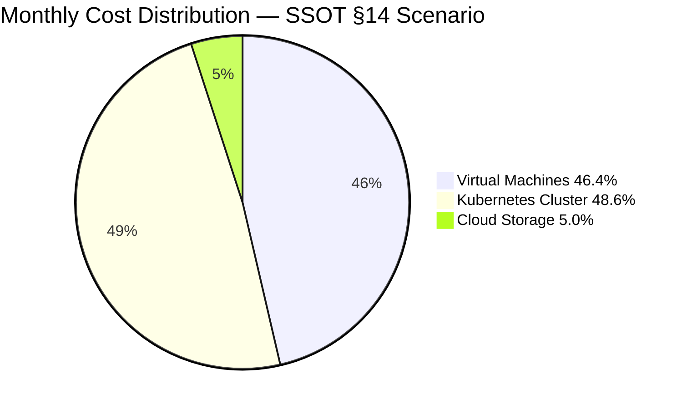

# CFO Bot — Pricing Strategy Document

**Prepared by**: CFO Bot (PS Cloud Cost Estimator)
**Reference**: SSOT `cfo-bot-ssot-ps-cloud-inspired.md`
**Currency**: Kazakhstani Tenge (KZT) | **Period**: Monthly

> [!NOTE]
> All prices in this document are the SSOT-defined rounded rates. No assumptions, discounts, or services outside the SSOT are introduced.

---

## 1. Executive Summary

This document uses the CFO Bot's unit economics — derived from PS Cloud's published infrastructure rates — to justify architectural decisions from a business cost perspective. The three supported service categories each have distinct cost drivers. Understanding these drivers allows teams to make informed decisions about sizing, storage tiering, and request volume.

The SSOT §14 canonical scenario (`2 VMs + 1-master/2-worker Kubernetes cluster + 500 GB storage`) produces:

| Service | Monthly Cost | Share |
|---|---|---|
| Virtual Machines | 57,000 KZT | 46.4% |
| Kubernetes Cluster | 59,800 KZT | 48.6% |
| Cloud Storage | 6,135 KZT | 5.0% |
| **Total** | **122,935 KZT** | **100%** |

Compute (VMs + Kubernetes nodes) accounts for **~95%** of the bill. Storage is structurally inexpensive at this scale. This shapes all architectural guidelines below.

---

## 2. Unit Economics — Cost Per Resource

### 2.1 CPU vs RAM Cost Ratio

| Resource | Rate | Cost for 10 units |
|---|---|---|
| CPU | 5,500 KZT/core/month | 55,000 KZT |
| RAM | 1,500 KZT/GB/month | 15,000 KZT |

**CPU is 3.67× more expensive than RAM per unit.** This has two implications:

1. **CPU-bound workloads are expensive.** A 16-core server at 4 GB RAM costs `(16×5500)+(4×1500) = 94,000 KZT/month`. The same RAM at 16 cores RAM-optimised `(4×5500)+(16×1500) = 46,000 KZT/month` costs 51% less.
2. **Rightsizing CPU matters most.** Reducing 2 cores per VM saves **11,000 KZT/VM/month**. Reducing 2 GB RAM saves only **3,000 KZT/VM/month**.

---

### 2.2 Disk Tiering — NVMe vs HDD

| Disk Type | Rate | Cost for 100 GB |
|---|---|---|
| NVMe | 140 KZT/GB/month | 14,000 KZT |
| HDD | 20 KZT/GB/month | 2,000 KZT |

**NVMe is 7× more expensive than HDD.** Guidelines:

- Use **NVMe** for operating system volumes, databases, and latency-sensitive workloads.
- Use **HDD** for large data archives, logs, or bulk object temp storage.
- In the SSOT §14 scenario, choosing HDD for all Kubernetes workers (80 GB × 2 nodes) saves `2 × (80×140 − 80×20) = 2 × 9,600 = 19,200 KZT/month` vs NVMe workers.

---

### 2.3 White IP Cost

| Resource | Rate |
|---|---|
| White/floating IP | 2,500 KZT/VM/month |

White IPs add **8.8%** to a minimum-spec 1-vCPU / 1-GB / 1-GB-NVMe VM's cost. For fleets where IPs are not needed externally (internal microservices, Kubernetes worker nodes), omitting the white IP reduces the per-VM bill predictably by 2,500 KZT.

---

### 2.4 Cloud Storage Economics

#### Volume cost

| Scale | Monthly cost |
|---|---|
| 100 GB | 1,200 KZT |
| 1 TB | 12,288 KZT |
| 10 TB | 122,880 KZT |

Storage volume is linear and low-cost at moderate scales.

#### Request cost

| Volume | Block count | Cost |
|---|---|---|
| 1,000 write requests | 1 block | 3 KZT |
| 100,000 write requests | 100 blocks | 300 KZT |
| 1,000,000 write requests | 1,000 blocks | 3,000 KZT |
| 10,000 read requests | 1 block | 3 KZT |
| 1,000,000 read requests | 100 blocks | 300 KZT |
| 10,000,000 read requests | 1,000 blocks | 3,000 KZT |

**Key insight**: read requests are billed in 10,000-unit blocks while writes are in 1,000-unit blocks. The same 3 KZT block rate means **reads are 10× cheaper per request than writes**. High-read workloads (CDN origin, media delivery, static assets) are structurally more economical than high-write workloads (logging, analytics ingestion).

---

## 3. Architectural Cost Justification — SSOT §14 Scenario

### 3.1 Virtual Machines (57,000 KZT/month)

**Configuration**: 2 VMs × (2 vCPU / 4 GB RAM / 50 GB NVMe / 100 GB HDD / White IP)

| Cost driver | Per VM | Both VMs |
|---|---|---|
| CPU (2 cores) | 11,000 KZT | 22,000 KZT |
| RAM (4 GB) | 6,000 KZT | 12,000 KZT |
| NVMe (50 GB) | 7,000 KZT | 14,000 KZT |
| HDD (100 GB) | 2,000 KZT | 4,000 KZT |
| White IP | 2,500 KZT | 5,000 KZT |
| **Total** | **28,500 KZT** | **57,000 KZT** |

**Justification**: CPU (38.6%) + NVMe (24.6%) are the dominant cost drivers. Switching from NVMe to HDD for secondary storage would reduce total VM cost by 10,000 KZT/month (17.5% savings). White IP cost is 8.8% per VM and represents a fixed overhead that should only be provisioned for internet-facing servers.

---

### 3.2 Kubernetes Cluster (59,800 KZT/month)

**Configuration**: 1 master (NVMe) + 2 workers (HDD)

| Node group | Count | Unit cost | Group cost |
|---|---|---|---|
| Master | 1 | 22,600 KZT | 22,600 KZT |
| Worker | 2 | 18,600 KZT | 37,200 KZT |
| **Cluster total** | | | **59,800 KZT** |

**Master vs Worker cost breakdown**:

| | Master | Worker |
|---|---|---|
| CPU (2 cores) | 11,000 KZT | 11,000 KZT |
| RAM (4 GB) | 6,000 KZT | 6,000 KZT |
| Disk | NVMe 40 GB = **5,600 KZT** | HDD 80 GB = **1,600 KZT** |

**Justification**: The design correctly separates disk tiers: masters use NVMe for etcd reliability; workers use HDD for cost efficiency. This tiering saves `2 × (80×140 − 80×20) = 19,200 KZT/month` vs a full NVMe worker fleet.

Per SSOT §5.7, there is **no cluster management overhead**. Kubernetes cost is purely node compute — a transparent, predictable billing model.

---

### 3.3 Cloud Storage (6,135 KZT/month)

| Component | Derivation | Cost |
|---|---|---|
| Volume (500 GB) | 500 × 12 | 6,000 KZT |
| Write requests (20K) | ceil(20K/1K) × 3 | 60 KZT |
| Read requests (250K) | ceil(250K/10K) × 3 | 75 KZT |
| **Total** | | **6,135 KZT** |

**Justification**: At 500 GB, storage volume cost dominates (97.8% of storage bill). Request costs are negligible (2.2%) at this volume-to-request ratio. This confirms object storage is cost-efficient for archival, backup, or static asset use cases. Only at very high request rates (billions/month) does request billing become a significant portion of the bill.

---

## 4. Cost Sensitivity Analysis

### 4.1 Impact of scaling VM fleet

| vm_count | Monthly cost | Incremental |
|---|---|---|
| 0 | 0 KZT | — |
| 1 | 28,500 KZT | +28,500 |
| 2 | 57,000 KZT | +28,500 |
| 5 | 142,500 KZT | +28,500 |
| 10 | 285,000 KZT | +28,500 |

Cost scales linearly. Each additional VM with the SSOT §14 spec costs **+28,500 KZT/month**.

---

### 4.2 Impact of adding Kubernetes worker nodes

| worker_count | Worker cost | Cluster total |
|---|---|---|
| 0 | 0 KZT | 22,600 KZT |
| 1 | 18,600 KZT | 41,200 KZT |
| 2 | 37,200 KZT | 59,800 KZT |
| 5 | 93,000 KZT | 115,600 KZT |
| 10 | 186,000 KZT | 208,600 KZT |

Each additional worker (§14 spec: 2 vCPU / 4 GB / 80 GB HDD) costs **+18,600 KZT/month**.

---

### 4.3 Storage break-even vs VM

One Kubernetes worker node (18,600 KZT/month) = **1,550 GB of object storage** at 12 KZT/GB.

This quantifies the compute premium: compute is significantly more expensive per unit than storage, confirming that storage-heavy architectures (large datasets with minimal compute) should prefer object storage over compute-attached disks whenever possible.

---

## 5. Architectural Recommendations (based on SSOT pricing only)

| Scenario | Recommendation | Rationale |
|---|---|---|
| Reduce VM cost | Lower CPU count first | CPU is 3.67× more costly than RAM per unit |
| Large disk needs | Use HDD for non-latency-sensitive data | HDD is 7× cheaper than NVMe |
| Internet-facing services only | Attach White IP only where needed | 2,500 KZT/VM/month fixed overhead |
| Kubernetes worker sizing | Use HDD workers unless DB/etcd | NVMe worker costs 7× more in disk line |
| High-read object storage | Prefer object storage over VM disks | 12 KZT/GB/month vs 140 KZT/GB/month (NVMe) |
| High-write workloads | Batch writes to reduce blocks | Ceiling billing: 1 write = 3 KZT minimum |
| Growing storage volume | Scale GB, not requests | Volume dominates; requests are marginal |

---

## 6. Month-over-Month Predictability

Because all rates are fixed and deterministic (SSOT §2, §9.2, §11):

- There are **no variable compute rates** (no burst pricing, no spot instances)
- There are **no discounts or promos** in scope
- There are **no region pricing differences**
- All monetary values **round to whole KZT** (SSOT §12)

This makes the CFO Bot's output suitable for:
- Monthly budget planning
- Infrastructure cost approval workflows
- Comparative architecture analysis
- Engineering-to-finance cost communication

---

## 7. Reference Rate Card

| Resource | Rate | Unit |
|---|---|---|
| CPU | 5,500 KZT | per core / month |
| RAM | 1,500 KZT | per GB / month |
| NVMe disk | 140 KZT | per GB / month |
| HDD disk | 20 KZT | per GB / month |
| White IP | 2,500 KZT | per VM / month |
| Object storage | 12 KZT | per GB / month |
| Write requests | 3 KZT | per 1,000 requests |
| Read requests | 3 KZT | per 10,000 requests |

*Source: SSOT §2.1 — PS Cloud-inspired, rounded rates.*
